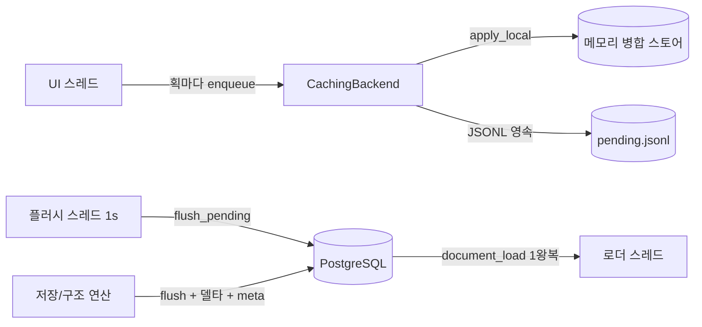

# FreeDF 동기화 프로토콜 & 알고리즘 해설

> 이 문서는 FreeDF가 문서(획·페이지·PDF)를 PostgreSQL과 주고받는 **델타 동기화
> 프로토콜**의 설계 이유와 수학을 정리합니다. LaTeX 수식은 GitHub 등에서
> `$…$` 렌더링을 지원하는 뷰어로 읽으면 됩니다.

---

## 1. 문제 정의

문서 하나에는 수천~수만 개의 획(stroke)이 있고, 각 획은 점 배열을 JSONB로
갖습니다. 두 가지 비용을 최소화해야 합니다.

$$
T_{\text{op}} = \underbrace{N_{\text{rt}} \cdot \text{RTT}}_{\text{왕복 지연}}
+ \underbrace{\frac{B}{\text{bw}}}_{\text{전송 시간}}
$$

- **왕복 지연**이 지배적입니다. 원격 VPS에서 RTT 100~300ms일 때, 문장 하나당
  지연이 곱해집니다.
- **전송 시간**은 1Gbps 링크에서 사실상 무시할 수 있습니다. 따라서 최적화는
  "바이트를 줄이는 것"이 아니라 **"왕복 수 $N_{\text{rt}}$ 와 문장 수를 줄이는
  것"** 입니다.

| 기존 문제 | 비용 |
|---|---|
| 획마다 `INSERT` 문장 1개 | $N_{\text{rt}} = O(\text{획 수})$ |
| 저장 시 전체 획 재전송 | $B = O(\text{전체 획 바이트})$ |
| 구조 연산(페이지 추가/삭제/회전)마다 전체 resync | 위 둘의 합 |

---

## 2. 아키텍처 개요



핵심 불변식:

$$
\text{로컬 캐시} = \text{원격 상태} \oplus \text{미처리 대기열}
$$

---

## 3. 저장 프로토콜 (델타)

획은 **write-behind**로 이미 증분 전송됩니다. 따라서 저장은 세 단계로
구성되며, **획을 다시 보내지 않습니다**.

1. `flush_pending` — 대기열에 남은 증분 반영 (보통 비어 있음)
2. 서버 구조 델타 (해당될 때만)
3. `document_sync_meta` — 페이지/문서 정보/PDF (획 불변)

### 3.1 메타 동기화 — `document_sync_meta`

```sql
document_sync_meta(doc_id, page_count, pages JSONB, pdf BYTEA)
```

페이지(용지/북마크)는 행 수가 페이지 수와 같고 아주 작으므로 전체 upsert로
보내도 됩니다. **획은 건드리지 않으므로 획 수와 무관하게** $O(1)$ 문장입니다.

$$
T_{\text{meta}} = \text{RTT} \quad (\text{획 수와 무관})
$$

### 3.2 페이지 중간 삽입 — `document_shift_strokes`

중간에 페이지가 들어가면 뒤 페이지의 획 `page_index`가 +1 되어야 합니다.
전체 획을 재전송하는 대신 **서버에서 인덱스만 이동**합니다.

$$
N_{\text{rt}} = 1, \quad B = 0 \ (\text{획 데이터 전송 없음})
$$

```sql
UPDATE strokes SET page_index = page_index + p_delta
WHERE doc_id = p_doc_id AND page_index >= p_from;
```

### 3.3 페이지 삭제 — `document_delete_page`

$$
N_{\text{rt}} = 1
$$

```sql
DELETE FROM strokes WHERE doc_id = p_doc_id AND page_index = p_page;
UPDATE strokes SET page_index = page_index - 1
WHERE doc_id = p_doc_id AND page_index > p_page;
```

### 3.4 회전 — `document_rotate_page` / `document_rotate_all`

클라이언트와 **동일한 변환을 서버 SQL로** 적용해 획 재전송을 없앱니다.
점 배열은 `jsonb_array_elements … WITH ORDINALITY`로 순회해 `jsonb_set`으로
x/y만 갱신하고 `jsonb_agg … ORDER BY ord`로 순서를 보존합니다.

$$
N_{\text{rt}} = 1, \quad B = 0
$$

---

## 4. 회전 수학

페이지 좌표계: 원점 좌상단, y는 아래로 증가. 회전 전 표시 크기
$w \times h$.

**시계방향 90°** (CW):

$$
\begin{pmatrix} x' \\ y' \end{pmatrix}
=
\begin{pmatrix} 0 & -1 \\ 1 & 0 \end{pmatrix}
\begin{pmatrix} x \\ y \end{pmatrix}
+
\begin{pmatrix} h \\ 0 \end{pmatrix}
\quad\Rightarrow\quad
(x, y) \mapsto (h - y, x)
$$

**반시계방향 90°** (CCW):

$$
\begin{pmatrix} x' \\ y' \end{pmatrix}
=
\begin{pmatrix} 0 & 1 \\ -1 & 0 \end{pmatrix}
\begin{pmatrix} x \\ y \end{pmatrix}
+
\begin{pmatrix} 0 \\ w \end{pmatrix}
\quad\Rightarrow\quad
(x, y) \mapsto (y, w - x)
$$

회전 행렬은 직교 행렬이므로 $R^4 = I$ — 4회 회전하면 원위치입니다.

**용지 줄(Ruled)도 종이와 함께 회전**해야 하므로, 렌더링은 표시 회전
$r \in \{0°, 90°, 180°, 270°\}$에 따라 줄 방향을 결정합니다.

$$
\text{orientation} =
\begin{cases}
\text{horizontal} & r \in \{0°, 180°\} \\
\text{vertical}   & r \in \{90°, 270°\}
\end{cases}
$$

균일 간격이므로 줄의 위상(시작 오프셋)은 시각적으로 구분되지 않아,
방향 전환만으로 기하학적으로 동일한 집합이 됩니다. Grid/점 스타일은
90° 회전에 불변이므로 그대로입니다.

---

## 5. 대량 삽입 배치 수학

write-behind 플러시는 `insert_strokes`로 청크 단위 다중 행 INSERT를 씁니다.
행당 파라미터 8개, PostgreSQL 바인드 파라미터 상한 65,535이므로:

$$
\text{청크 크기} = \left\lfloor \frac{65{,}535 - 1}{8} \right\rfloor \approx 4{,}000
$$

$$
N_{\text{rt}} = 1 + \left\lceil \frac{N_{\text{strokes}}}{4{,}000} \right\rceil
$$

동일하게 페이지 upsert(행당 파라미터 5개), 편집 저널(3개), 이벤트 로그(2개)도
4,000~500행 청크를 사용합니다. 또한 `coalesce_ops`가 대기열의 연속 동일 작업을
병합해 왕복을 추가로 줄입니다.

> 주의: Postgres의 데이터 수정 CTE는 **같은 스냅샷을 공유**하므로
> `WITH del AS (DELETE …) INSERT …`에서 삭제 키와 삽입 키가 겹치면 PK 충돌이
> 납니다. 키 집합이 겹치는 재동기화는 DELETE와 INSERT를 **별도 문장**으로
> 분리했습니다 (이후 델타 프로토콜로 해당 경로 자체를 제거).

---

## 6. 로드 프로토콜 — `document_load`

$$
N_{\text{rt}} = 1
$$

```sql
document_load(doc_id) → (strokes JSONB, pages JSONB, edits JSONB, session JSONB)
```

서버가 `jsonb_agg`로 전체 획 배열을 집계해 주므로 클라이언트는 **단일 패스**
serde 파싱으로 끝납니다. 획마다 `Value → 문자열 → 파싱`을 반복하던 이중 변환을
제거했습니다.

$$
T_{\text{load}} = \text{RTT} + O\left(\frac{B_{\text{strokes}}}{\text{parse rate}}\right)
$$

---

## 7. 획 ID 풀 (스토로크 시퀀스)

획 ID는 전역 시퀀스 `stroke_id_seq`에서 발급합니다. UI 스레드가 절대 DB를
호출하지 않도록 백그라운드로 $P = 256$개를 미리 받아 두고, 남은 양이
절반 미만이면 재보충을 예약합니다.

풀이 마르지 않을 충분 조건 (그리는 속도 $v$획/초, RTT $t$):

$$
\frac{P}{2v} \gg t
$$

즉 256개 풀에서 절반(128획)을 다 그리기 전에 보충(왕복 1회)이 도착해야
합니다. $t = 0.3$s라면 초당 400획까지도 안전합니다. 그래도 풀이 마르면
**동기 호출로 블로킹하지 않고** 로컬 ID로 폴백해 그립니다 (UI 무정지 우선).

---

## 8. 프로토콜 요약

| 연산 | 왕복 수 | 전송 획 데이터 | 서버 함수 |
|---|---|---|---|
| 필기 (증분) | 배치당 1 | 해당 획만 | `insert_strokes` |
| 저장 | 1~2 | **없음** | `flush_pending` + `sync_meta` |
| 페이지 끝에 추가 | 1~2 | 없음 | `sync_meta` |
| 페이지 중간 추가 | 2~3 | 없음 | `shift_strokes` + `sync_meta` |
| 페이지 삭제 | 2~3 | 없음 | `delete_page` + `sync_meta` |
| 회전 | 2~3 | 없음 | `rotate_page` + `sync_meta` |
| 전체 회전 | 2 | 없음 | `rotate_all` + `sync_meta` |
| 문서 열기 | 3 | 전체(1회) | `document_load` |

실측 (로컬 DB, 5,000획):

```
insert 5000 strokes = 335ms
sync_meta            =   6ms   ← 획 수와 무관
document_load        = 144ms
rotate               = 110ms   ← 재전송 없이 서버 UPDATE
```

---

## 9. 정합성

- **구조 연산 순서**: 구조 연산은 `flush_pending → 서버 델타 → sync_meta`를
  지켜야 합니다. 대기열의 증분이 옛 인덱스로 서버에 가는 것을 먼저 비우고,
  인덱스 이동이 끝난 뒤 새 획이 새 인덱스로 쌓이기 때문입니다.
- **회전/삭제 시 편집 저널 초기화**: 좌표계가 바뀌므로 undo 저널은 폐기합니다
  (`clear_edits`).
- **PDF 캐시**: 저장 성공 시 로컬 PDF 캐시를 갱신해 재오픈 시 낡은 본문이
  나오지 않게 합니다.
- **복구 경로**: `document_sync`(0006)는 전체 resync용으로 DB에 남아 있지만
  앱 코드에서는 호출하지 않습니다 (수동 복구/테스트 전용).

---

## 10. 마이그레이션 매핑

| 파일 | 함수 |
|---|---|
| `0006_document_sync.sql` | `document_sync` (복구용 전체 resync) |
| `0007_document_load.sql` | `document_load` (1왕복 로드) |
| `0008_document_delta.sql` | `document_sync_meta`, `document_shift_strokes`, `document_delete_page`, `document_rotate_page`, `document_rotate_all` |
