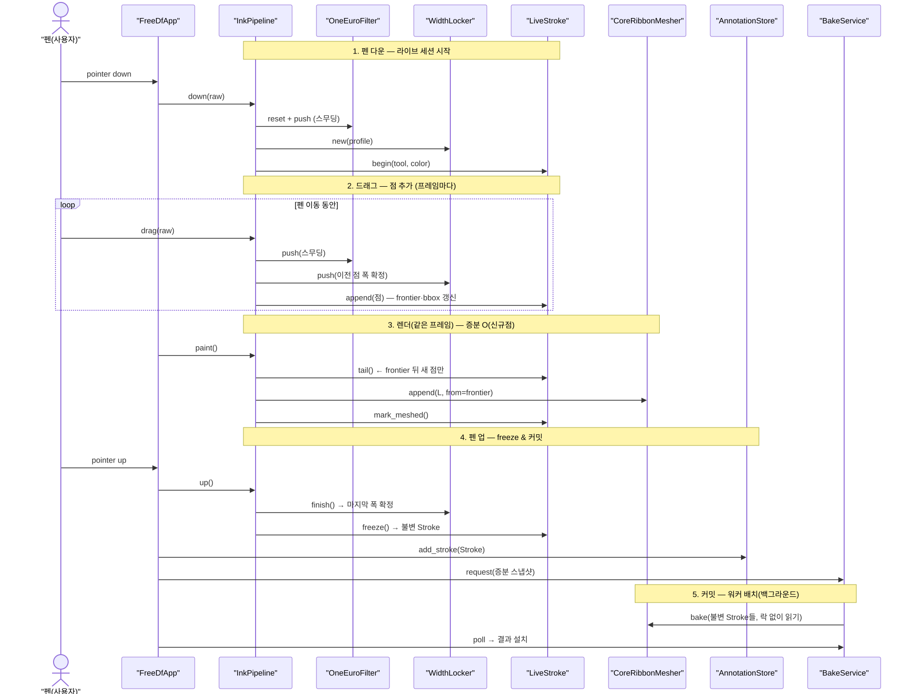

# FreeDF 쓰기 파이프라인 — 호출 다이어그램 (InkPipeline 설계)

> 펜(또는 마우스)으로 노트/PDF에 그릴 때의 **객체 구조**를 두 관점으로 나타낸다.
>
> - **다이어그램 A(정적)** : 클래스 간 사용(Association) 관계
> - **다이어그램 B(동적)** : 객체 인스턴스 간 호출 순서 (스트로크 하나의 수명주기)
>
> 설계 핵심: 진행 획을 `InkPipeline`(필터·락커·`LiveStroke` 조율) 하나로 묶어
> **호출 시퀀스를 압축**하고, 커밋 시 `LiveStroke.freeze()`가 **불변 `Stroke`**를
> 만들어 워커/History가 안전하게 공유하게 한다. (인터페이스·TDD 명세는
> [`docs/ink-pipeline-design.md`](./ink-pipeline-design.md))

---

## A. 정적 클래스 수준 (Class Diagram, Association)



### 읽는 법
- 모든 화살표는 **Association**(`-->`) = 한 클래스가 다른 클래스를 **사용/참조**.
- `FreeDfApp`이 살아있는 획의 세 협력자(`OneEuroFilter`·`WidthLocker`·`ActiveStroke`)를
  직접 알지 않고 **`InkPipeline` 하나로만** 연관 → fan-out 축소 + SRP.
- `LiveStroke`는 append-only 점 버퍼로, `CoreRibbonMesher`가 `tail()`로 증분 메시를 만든다.
- 커밋된 획은 불변 `Stroke`가 되어 `AnnotationStore`(저장)·`BakeService`(워커 배치)에 공유된다.
- 잉크 렌더는 **`BakeService → CoreRibbonMesher → Mesh`** 배치 경로가 독립.

---

## B. 동적 객체 인스턴스 수준 (Sequence Diagram)



### 흐름 요약
```
펜 down → InkPipeline.down → 필터 리셋 + WidthLocker 생성 + LiveStroke.begin
드래그  → drag() 1회가 [필터 → 락커(이전 폭 확정) → append(frontier·bbox 갱신)] 내부 처리(반복)
렌더    → tail()로 frontier 뒤 점만 CoreRibbonMesher에 증분 append(O(신규점)) → mark_meshed
펜 up   → up() → finish(마지막 폭 확정) → freeze() → 불변 Stroke → AnnotationStore.add → BakeService 요청
커밋    → BakeService(백그라운드 워커)가 불변 Stroke들을 락 없이 읽어 bake → Mesh → 화면
```
